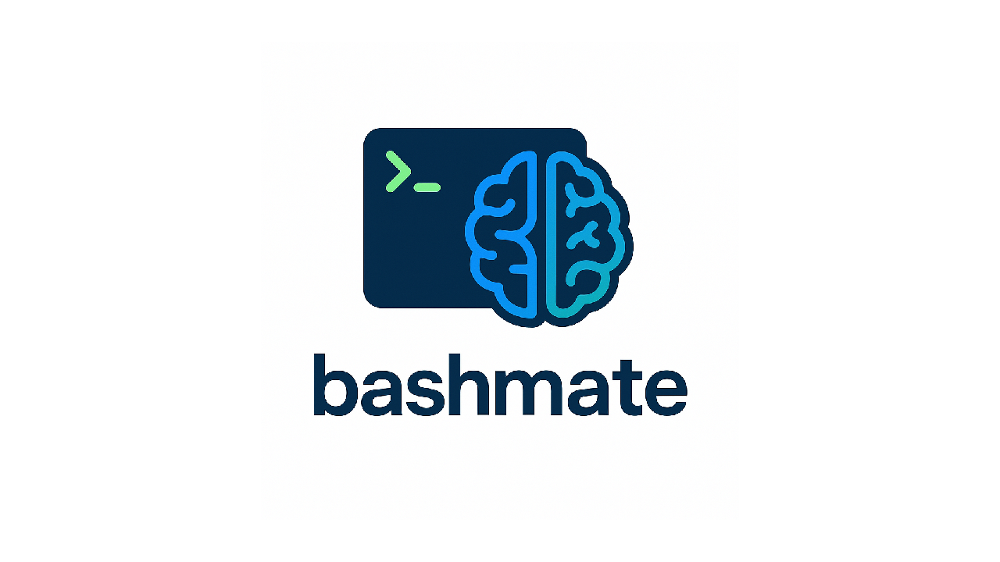
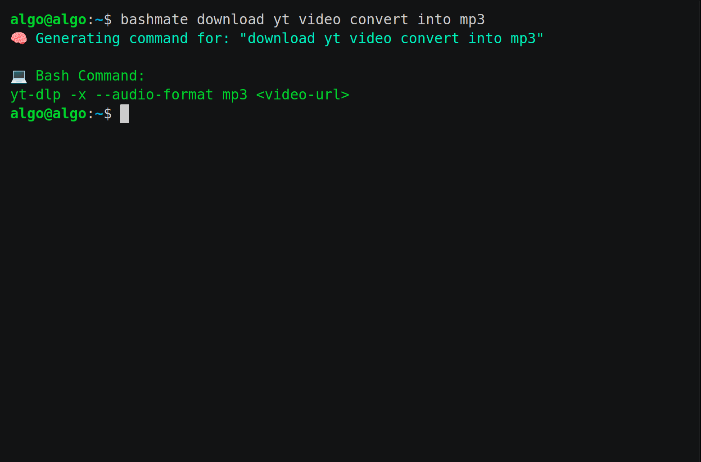

<h3 align="center"></h3>
<p align="center">Make Bash your mate — with natural language commands powered by Groq AI</p>

<p align="center">
<a href="./LICENSE.md"></a>
</p>

**Bashmate** is a command-line tool written in `bash` and powered by **Groq AI**. It allows you to convert plain English instructions into valid Bash commands effortlessly.

Whether you're a beginner learning the command line or a pro looking to save time, **Bashmate** makes Bash more accessible and conversational.

## 🚀 Why bashmate?

Unlike other tools or fancy AI terminals, **bashmate** is:
- ⚡️ **Fast** — works right in your terminal
- 🧠 **Smart** — powered by Groq AI
- 🪶 **Lightweight** — no bulky GUI or shell extensions
- 🛠️ **Hackable** — open-source and easy to extend
- 🌍 **Multi-language** — understands commands in multiple languages via Groq AI


## 🔧 Installation

```bash
git clone https://github.com/algobuddha/bashmate.git
cd bashmate
npm install
npm link
```
## 🗝️ API Key setup

1. Got to https://console.groq.com/keys
2.  Create an account.
3.  Generate an API Key.
4.  Create a `.env` file in project directory.
5. `GROQ_API_KEY =YOUR KEY`

## 💡 Example 
<h3 align="center"></h3>